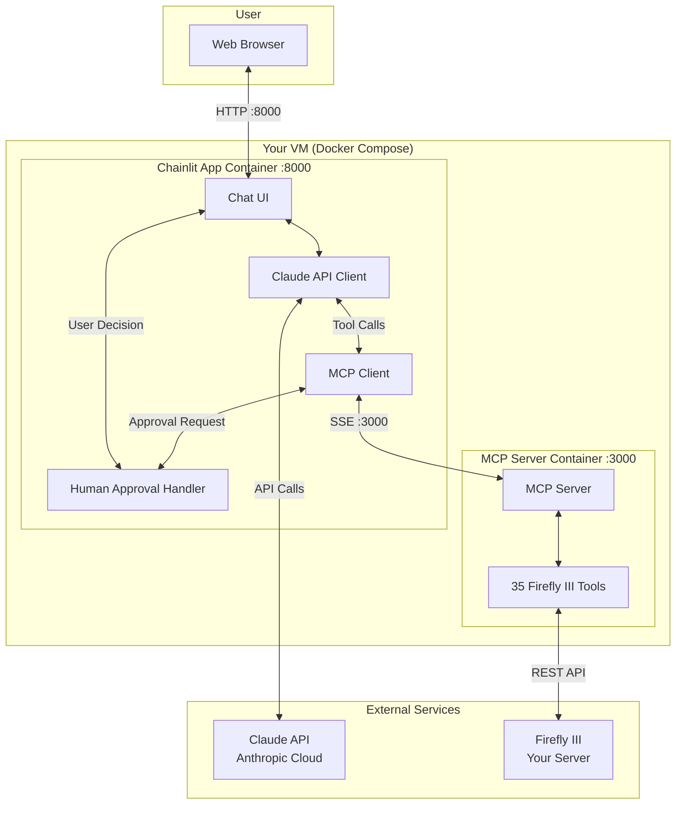
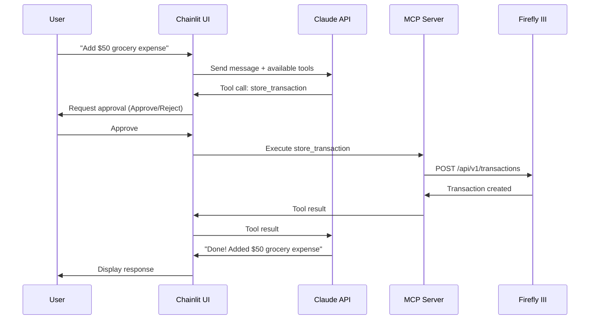
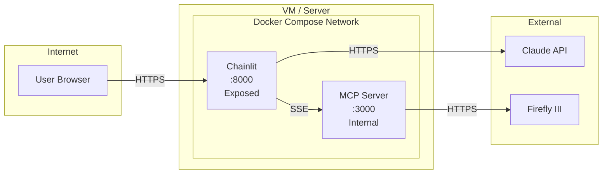

# Firefly Assistant - Architecture & Requirements

## Overview

Firefly Assistant is a conversational AI interface for managing personal finances through Firefly III, powered by Claude and the Model Context Protocol (MCP).

## Architecture Diagram



## Component Interaction Flow



## Full Requirements List

### Functional Requirements

| ID | Requirement | Status |
|----|-------------|--------|
| FR-01 | Connect to Firefly III via MCP | Implemented |
| FR-02 | Chat interface for finance management | Implemented |
| FR-03 | Human approval before tool execution | Implemented |
| FR-04 | Support multiple tool calls in one response | Implemented |
| FR-05 | Streaming responses from Claude | Implemented |
| FR-06 | Tool filtering via presets (basic, full, etc.) | Implemented |

### Non-Functional Requirements

| ID | Requirement | Status |
|----|-------------|--------|
| NFR-01 | Docker-based deployment | Implemented |
| NFR-02 | Single VM hosting | Implemented |
| NFR-03 | Chainlit only exposed externally | Implemented |
| NFR-04 | MCP server internal only | Implemented |
| NFR-05 | Environment-based configuration | Implemented |

### Future Requirements (Out of Scope)

| ID | Requirement | Status |
|----|-------------|--------|
| FUT-01 | Conversation memory/persistence | Planned |
| FUT-02 | Resume previous chat sessions | Planned |
| FUT-03 | Multi-user authentication | Planned |
| FUT-04 | OpenAI API support | Planned |

## Full Feature List

### Core Features

| Feature | Description |
|---------|-------------|
| **MCP Integration** | Native Chainlit MCP support via SSE connection |
| **Claude AI** | Powered by Claude claude-sonnet-4-20250514 with streaming |
| **Tool Calling** | 35 Firefly III tools available (basic preset) |
| **Human Approval** | Approve/Reject prompt before any tool execution |
| **Multi-Tool Support** | Handles multiple tool calls in single response |

### Firefly III Tools (Basic Preset)

| Category | Tools |
|----------|-------|
| **Accounts** | list_account, get_account, store_account, update_account, delete_account, search_accounts |
| **Transactions** | list_transaction, get_transaction, store_transaction, update_transaction, delete_transaction, search_transactions |
| **Categories** | list_category, get_category, store_category, update_category, delete_category |
| **Tags** | list_tag, get_tag, store_tag, update_tag, delete_tag |
| **Summary** | get_basic_summary |
| **By Relations** | list_transaction_by_account, list_transaction_by_category, list_transaction_by_tag, etc. |

### UI Features

| Feature | Description |
|---------|-------------|
| **Chat Interface** | Conversational UI for finance management |
| **MCP Connection Panel** | Connect/disconnect MCP servers |
| **Tool Steps** | Visual display of tool execution steps |
| **Action Buttons** | Approve/Reject buttons for tool approval |
| **Streaming** | Real-time response streaming |

## Technology Stack

| Layer | Technology |
|-------|------------|
| **Frontend** | Chainlit (React-based) |
| **Backend** | Chainlit (Python/FastAPI) |
| **AI** | Claude API (Anthropic) |
| **Protocol** | Model Context Protocol (MCP) |
| **MCP Server** | Node.js / TypeScript |
| **Deployment** | Docker Compose |
| **Finance Backend** | Firefly III |

## Configuration

### Environment Variables

| Variable | Description | Required |
|----------|-------------|----------|
| `ANTHROPIC_API_KEY` | Anthropic API key for Claude | Yes |
| `FIREFLY_III_PAT` | Firefly III Personal Access Token | Yes |
| `FIREFLY_III_BASE_URL` | Firefly III instance URL | Yes |
| `FIREFLY_III_PRESET` | Tool preset (basic, full, budget, etc.) | No (default: basic) |
| `MCP_SERVER_URL` | MCP server SSE endpoint | No (default: http://mcp-server:3000/sse) |

### Tool Presets

| Preset | Description | Tool Count |
|--------|-------------|------------|
| `basic` | Core finance tools | ~35 |
| `budget` | Budget-focused operations | ~40 |
| `reporting` | Analytics and insights | ~45 |
| `full` | All available tools | 694 |

## Security Considerations

| Aspect | Implementation |
|--------|----------------|
| **API Keys** | Stored in `.env` file, not in code |
| **MCP Server** | Internal only, not exposed externally |
| **Tool Execution** | Requires human approval |
| **Network** | Docker internal network for service communication |

## Deployment Architecture



## File Structure

```
firefly-assistant/
├── docker-compose.yml          # Service orchestration
├── .env.example                 # Environment template
├── .gitignore
├── README.md                    # Quick start guide
├── docs/
│   └── ARCHITECTURE.md          # This file
├── chainlit-app/
│   ├── Dockerfile
│   ├── app.py                   # Main application
│   ├── requirements.txt
│   ├── chainlit.md              # Welcome message
│   └── .chainlit/
│       └── config.toml          # Chainlit config
└── mcp-server/
    └── Dockerfile               # Builds from public repo
```
